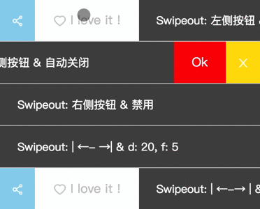
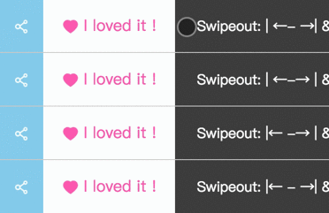
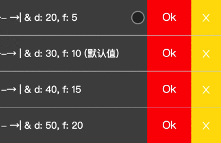
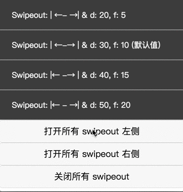
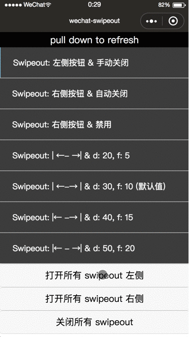

# Wechat Swipeout

Inspired by [miniprogram-slide-view](https://github.com/wechat-miniprogram/slide-view), [react-native-swipeout](https://github.com/dancormier/react-native-swipeout).

## DEMO

### 手动关闭 or 自动关闭

- 第一个按钮手动地调用了 swipeout 的 `close` 方法
- 第二个 swipeout 设置了 `auto-close="true"`
- 最后一个 swipeout 什么也没做



### 吸附效果

1. 第一个 swipeout：左不吸附，右吸附
2. 第二个 swipeout：左不吸附，右不吸附
3. 第三个 swipeout：左吸附，右不吸附
4. 第四个 swipeout：左吸附，右吸附

 

### 摩擦系数

摩擦系数决定滑动速度：



### 禁用效果

设置了 `disabled="true"` 的 swipeout，无论开发者调用暴露的“打开”／“关闭”方法，还是用户触摸拖动滑块，都无效：



### 探索更多

以上仅演示部分效果，更多效果可以本地运行 demo 来体验：

1. `git clone git@github.com:baishusama/wechat-swipeout.git && cd wechat-swipeout && npm i && npm run dev`
2. 使用微信开发者工具打开 `./miniprogram_dev/` 这个 demo 小程序
3. enjoy it!

## 使用方法

> 关于小程序自定义组件的使用，详见[官方项目说明](https://github.com/wechat-miniprogram/miniprogram-custom-component)。

1. 安装 wechat-swipeout ：

```
npm i -S wechat-swipeout
```

2. 微信开发者工具 -> 工具 -> 构建 npm => 这步会生成 `miniprogram_npm/wechat-swipeout/index.(js|json|wxml|wxss)`
3. 在需要使用本组件的页面/组件的 `*.json` 文件中，设置组件 alias 和路径：

```json
{
  "usingComponents": {
    "swipeout": "wechat-swipeout"
  }
}
```

4. `*.wxml` 文件中，可以使用 `swipeout`：

```html
<swipeout class="swipeout" height="120" right-buttons="{{rightButtonList}}" auto-close="true" background-color="black" bind:press="onSwipeoutPress">
  <view class="main-content">Swipeout: 右侧按钮 & 自动关闭</view>
</swipeout>
```

更多示例，请参考 [github repo](https://github.com/baishusama/wechat-swipeout) 的 [`tools/demo/pages/index/index.wxml`](https://github.com/baishusama/wechat-swipeout/blob/master/tools/demo/pages/index/index.wxml) 文件内容。

具体接口参见 [API](#api) 小节。

## API

### 组件整体

#### 属性

| 属性 | 类型 | 可选 | 默认值 | 描述 |
|:-----|:-----|:---:|:------|:-----|
| `width` | number | 可选 | `750` | 主区域宽度 | 
| `height` | number | 可选 | `0` | 高度 |
| `background-color` | string | 可选 | `''` | 背景色 |
| `auto-close` | boolean | 可选 | `false` | 是否点击按钮后自动关闭 |
| `disabled` | boolean | 可选 | `false` | 禁用状态 |
| `damping` | number | 可选 | `30` | 阻尼系数，控制动画和过界回弹动画；越大越快 |
| `friction` | number | 可选 | `10` | 摩擦系数，控制惯性滑动；越大越快 |

#### 事件

| 事件 | 类型 | 可选 | 默认值 | 描述 |
|:-----|:-----|:---:|:------|:-----|
| `press` | method name | 可选 |  | 点击按钮时触发，会回传按钮的 hash 字段 | 

#### 暴露的方法

- `close` 关闭 swipeout
- `openLeft` 打开 swipeout 的左侧按钮
- `openRight` 打开 swipeout 的右侧按钮

### 两侧按钮

| 属性 | 类型 | 可选 | 默认值 | 描述 |
|:-----|:-----|:---:|:------|:-----|
| `(left|right)ButtonWidth` | number | 可选 | `0` | 左／右侧每个按钮的宽度 | 
| `(left|right)Width` | number | 可选 | `0` | 左／右侧所有按钮的宽度之和 | 
| `(left|right)Buttons` | SwipeoutButton[] | 可选 | `null` | 左／右侧按钮列表 | 
| `stickTo(Left|Right)Edge` | boolean | 可选 | `false` | 左／右侧按钮是否吸附边缘 | 

#### 关于 `SwipeoutButton` 类型

| 属性 | 类型 | 可选 | 默认值 | 描述 |
|:-----|:-----|:---:|:------|:-----|
| `hash` | string | 必须 |  | 按钮的唯一标识；点击按钮（`press`）时会回传 hash，可以此区分按钮并执行对应事件 | 
| `className` | string | 可选 |  | 按钮的类名，可用于微调样式 |
| `width` | number | 可选 |  | 按钮的宽度，单位 rpx |
| `iconPath` | string | 可选 |  | 按钮的 icon 的路径；注意，组件构建后位于 `miniprogram_npm/` 目录下，设置 `iconPath` 时需要考虑进去 |
| `text` | string | 可选 |  | 按钮的文字 |
| `color` | string | 可选 |  | 按钮的字体颜色 |
| `backgroundColor` | string | 必须 |  | 按钮的背景色 |
| `underlayColor` | string | 必须 |  | 按钮被点击时的背景色 |

## License

This project is licensed under the MIT License